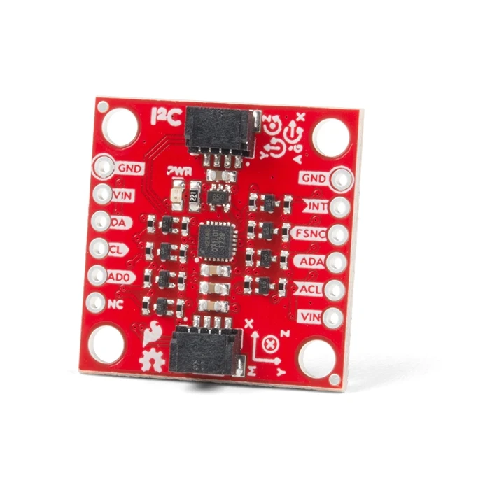

# LiftIQ

### Your barbell, smarter.

A smart weightlifting assistant that turns raw IMU motion data into real-time training feedback on your phone.


> Note: Raspberry Pi + Android is the primary tested setup today. iOS and web support depend on local Expo/network setup.

<p align="center">
  
</p>

## Why LiftIQ?

- Local-first: workout processing runs on your own hardware.
- Real sensor pipeline: captures real barbell motion, not simulated input.
- No subscription model: bring your own hardware and APIs.
- Lightweight workflow: connect, start session, lift, review.
- Built to scale: velocity, ROM, lift classification, and form analytics.

## Features

- Real-time IMU capture from a barbell-mounted 9-DoF sensor
- WebSocket streaming from Raspberry Pi to mobile app
- Start/stop workout sessions with live rep updates
- Rep counting and session-level workout summaries
- Velocity-loss fatigue tracking with stop-set recommendations
- Calibration-based E1RM estimation (per exercise, persistent on device)
- Offline velocity-based fatigue & E1RM model trained from raw set data
- Export-ready data path for analysis and iteration
- Offline ML workflow for preprocessing, training, and TFLite export

## Hardware

<p align="center">
  
</p>

Current setup:

- Raspberry Pi (sensor polling and transport)
- SparkFun ICM-20948 IMU (accelerometer, gyroscope, magnetometer)
- Power bank for portability
- Barbell mount (MVP rig)

Placement guidance:

- Mount the IMU rigidly on the barbell shaft.
- Keep Raspberry Pi off-bar to reduce vibration noise.

## Architecture

- `src/` React Native (Expo) app UI and workout flow
- `src/context/CalibrationContext.js` persistent calibration + E1RM utilities
- `src/utils/sessionStorage.js` local session save/load/export
- `raspi_files/` Raspberry Pi sensor + WebSocket server
- `ml/` preprocessing, model training, reports, and export scripts

## Quick Start

Mobile app:

```bash
npm install
npm run start
```

Pi server:

```bash
cd raspi_files
python ws_server.py
```

Default WebSocket endpoint:

- `ws://<pi-ip>:8765`

## ML Pipeline

From repo root.

### Lift classification (Model 3, 1D CNN)

```bash
python ml/scripts/preprocess_recgym.py
python ml/scripts/train_classifier.py
python ml/scripts/export_tflite.py
```

### Fatigue & E1RM (Model 5, velocity-based training)

```bash
python ml/scripts/train_fatigue_model.py
```

Offline counterpart to the on-device Model 5 logic
(`src/context/CalibrationContext.js` load-velocity regression and
`raspi_files/pi/velocity.py` velocity tracking). It reconstructs per-rep bar
velocity from each raw set, fits per-exercise load-velocity profiles for E1RM,
and trains a lightweight fatigue model that predicts end-of-set velocity loss.
Requires `numpy`, `pandas`, and optionally `scikit-learn` for cross-validated
metrics.

Outputs:

- `ml/models/`
- `ml/reports/`

## Roadmap

- Improve rep detection stability across more lift patterns
- Strengthen velocity and ROM metric accuracy
- Expand classifier quality and confidence handling
- Improve session trends and analytics UX
- 3D bar-path reconstruction and motion replay (Model 6)
- Evaluate BLE as an alternative to Wi-Fi transport
